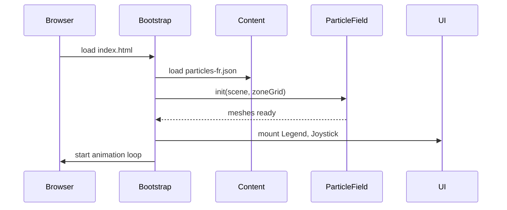
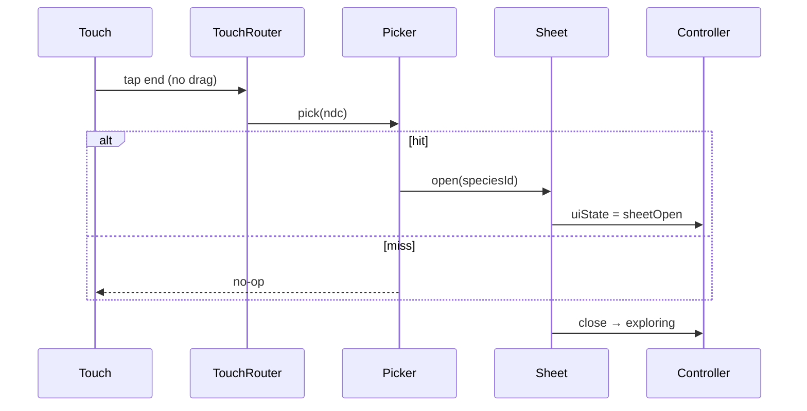

# Architecture Decision Document — App Educ Morgane

Document de référence technique pour l'implémentation cohérente par agents IA et développeurs. Source produit : [PRD final](./prds/prd-App%20Educ%20Morgane-2026-05-26/prd.md).

---

## Project Context Analysis

### Requirements Overview

**Exigences fonctionnelles (11 FR) — implications architecture :**

| Domaine | FR | Besoin technique |
|---------|-----|------------------|
| Scène 3D | FR-1, FR-2 | Moteur WebGL, boucle render, volume borné, animation particules |
| Particules | FR-3, FR-4, FR-5 | Instancing, générateur proportions, grille zones + placement CO₂ |
| Navigation | FR-6 | Contrôles first-person tactiles (joystick + regard) |
| Interaction | FR-7, FR-8 | Raycasting, modale HTML/CSS au-dessus du canvas |
| UI | FR-9, FR-10 | Overlay DOM français, légende, contenu JSON statique |
| Déploiement | FR-11 | Build statique, hébergement HTTPS sans backend |

**NFR transverses :**

- Tablette Chrome/Safari, paysage prioritaire
- Framerate fluide perçu (pas de freeze > 500 ms en navigation)
- Fiche < 1 s après touch
- Pas d'auth, pas d'API, pas de base de données
- Pas d'analytics nominatives v1

### Scale & Complexity

- **Domaine principal :** application web front-end 3D (client-only)
- **Niveau de complexité :** **faible à moyen** — un module, pas de multi-tenant ni temps réel serveur
- **Composants architecturaux estimés :** 6 modules (`scene`, `controls`, `interaction`, `ui`, `content`, `config`)

### Technical Constraints & Dependencies

- Visualisation **pédagogique** : pas de moteur physique (pas de Rapier/Cannon)
- **Instancing obligatoire** pour des milliers de particules sur tablette
- **Règle CO₂ option B** : contrainte de génération spatiale (≥ 1 CO₂ par zone)
- Open question UX contrôles → **décision architecture** : joystick virtuel + zone regard (aligné addendum PRD)

### Cross-Cutting Concerns

- Séparation **canvas WebGL** / **UI DOM** (modale, légende, joystick)
- Routage des événements touch (navigation vs sélection particule vs UI)
- Constantes de scène centralisées (proportions, couleurs, bornes volume)
- Contenu pédagogique externalisé (JSON) pour validation Morgane sans toucher au code 3D

---

## Starter Template Evaluation

### Domaine identifié

Application web 3D légère, déployée en statique — **pas** de full-stack ni React obligatoire.

### Choix retenu

| Technologie | Version (mai 2026) | Rôle |
|-------------|-------------------|------|
| **Vite** | 8.0.x (ex. 8.0.14) | Build dev + production, HMR |
| **TypeScript** | 5.x | Typage scène, contrats particules |
| **Three.js** | 0.184.0 (r184) | Rendu WebGL, InstancedMesh, Raycaster |
| **Node.js** | 20.19+ ou 22.12+ | Requis par Vite 8 |

**Commande d'initialisation :**

```bash
npm create vite@latest app-educ-morgane -- --template vanilla-ts
cd app-educ-morgane
npm install three@0.184.0
```

**Alternatives écartées :**

| Option | Raison d'écart |
|--------|----------------|
| Next.js | SSR/API inutiles ; complexité inutile pour site statique |
| React Three Fiber | Couche React non requise ; vanilla Three.js suffit pour v1 |
| Unity WebGL | Poids bundle, hors écosystème web classe |
| Babylon.js | Valide, mais addendum et écosystème pointent Three.js |

**Note Vite 8 :** bundler unifié Rolldown ; pour ce petit projet, config par défaut suffit.

---

## Core Architectural Decisions

### Decision Priority Analysis

**Critiques (bloquent l'implémentation) :**

1. Grille de **zones explorables** + algorithme placement CO₂
2. **InstancedMesh** par type de géométrie moléculaire
3. Schéma **routage touch** (navigation / pick / UI)
4. Hébergement **statique** HTTPS

**Importantes (forment l'architecture) :**

5. Contenu fiches en **JSON** versionné
6. Cap **devicePixelRatio** et budget particules
7. Contrôles **joystick + regard** sur zones tactile distinctes

**Reportées post-MVP :**

- i18n, PWA hors-ligne, analytics, fiches par niveau (v2 PRD)

### Data Architecture

**Pas de base de données.** Données statiques :

```
src/content/particles-fr.json
```

```json
{
  "species": [
    {
      "id": "N2",
      "name": "Diazote",
      "formula": "N₂",
      "proportionLabel": "~78 %",
      "body": "..."
    }
  ]
}
```

- Chargement au boot (`fetch` ou import statique Vite)
- Validation runtime minimale : présence des 4 `id` (`N2`, `O2`, `Ar`, `CO2`)

### Authentication & Security

- **Aucune auth** v1
- Site public en lecture seule
- Pas de secrets dans le repo ; pas de variables d'environnement sensibles
- Headers sécurité au niveau hébergeur (HTTPS forcé) — config plateforme, pas app

### API & Communication

- **Pas d'API REST/GraphQL**
- Communication interne : événements DOM custom optionnels (`particle:selected`) entre modules — voir Patterns

### Frontend Architecture

| Décision | Choix | Rationale |
|----------|-------|-----------|
| Paradigme | **Vanilla TypeScript + Three.js** | Simplicité, bundle minimal, aligné addendum |
| État UI modale | Variable module `uiState` (`exploring` \| `sheetOpen`) | Bloque navigation quand fiche ouverte (FR-7) |
| Rendu | `WebGLRenderer` + `requestAnimationFrame` | Standard Three.js |
| Particules | `InstancedMesh` par **géométrie fusionnée** (N₂, O₂, Ar, CO₂) | Performance tablette |
| Sélection | `Raycaster` + liste `instanceId → speciesId` | FR-7, touch |
| UI overlay | DOM HTML/CSS (`position: fixed`), pas `CSS2DRenderer` v1 | Modale accessible, FR-8 |
| Styles | CSS modules ou fichier `ui.css` global léger | Pas de Tailwind requis v1 |

### Infrastructure & Deployment

| Décision | Choix | Rationale |
|----------|-------|-----------|
| Hébergement | **Vercel** ou **Netlify** ou **GitHub Pages** | Lois choisit ; tous supportent `dist/` statique |
| CI | GitHub Actions : `npm ci` → `npm run build` → deploy | Optionnel v1, recommandé |
| Build output | `dist/` | Convention Vite |
| Base path | `/` (racine) | URL simple pour QR code classe |
| Environnements | `production` uniquement v1 | Pas de staging requis |

**Commandes :**

```bash
npm run build   # → dist/
npm run preview # test local production
```

### Décision clé : Zone explorable (réponse open question PRD §9.2)

**Définition retenue :**

- Volume de scène : cube **40 × 40 × 40** unités Three.js, centré à l'origine (bornes X/Z/Y : ±20).
- Partition : grille **4 × 4 × 4 = 64 zones** (cellules de 10 × 10 × 10).
- Une **Zone explorable** = une cellule `(ix, iy, iz)` avec `ix, iy, iz ∈ {0,1,2,3}`.

**Algorithme de génération (FR-3, FR-4) :**

1. Calculer `N_total` (défaut **3 000** particules, constante ajustable — voir Performance).
2. Allouer par proportion stricte :
   - `N_N2 = floor(N_total * 0.7808)`
   - `N_O2 = floor(N_total * 0.2095)`
   - `N_Ar = floor(N_total * 0.0093)`
   - Reste éventuel → N₂ (gaz dominant)
3. **CO₂ :** exactement **64** instances (1 par zone), position aléatoire **à l'intérieur** de chaque cellule — **pas** comptées dans les 3000 (total rendu ≈ 3064).
4. Positions N₂/O₂/Ar : uniforme aléatoire dans le volume global, avec rejet si collision visuelle trop proche (distance min 0.8 u) — max 10 tentatives puis accepter.
5. Vélocité initiale aléatoire faible ; rebond sur les parois du cube (wrap ou reflect) — animation pédagogique, pas physique.

**Conséquence :** SM-4 satisfait par construction (1 CO₂ trouvable par zone).

### Décision clé : Contrôles first-person tablette (réponse open question PRD §9.1)

| Zone écran | Gestuelle | Action |
|------------|-----------|--------|
| **Moitié gauche** | Joystick virtuel (nipplejs ou implémentation maison) | Avancer / reculer / strafe |
| **Moitié droite** | Drag 1 doigt (si `uiState === exploring`) | Rotation regard (yaw/pitch clampé) |
| **Tap** sur canvas (pas drag) | Raycast | Ouvre Fiche particule |
| **Modale ouverte** | — | Désactive joystick et regard |

- Hauteur caméra fixe ~1.6 u (échelle pédagogique).
- Vitesse déplacement : 8 u/s ; sensibilité regard : 0.002 rad/pixel.
- **Desktop secondaire :** WASD + souris (bonus, non prioritaire QA).

### Performance Budget

| Paramètre | Valeur v1 | Notes |
|-----------|-----------|-------|
| `N_total` | 3000 | Réduire à 2000 si iPad ancien en test |
| `devicePixelRatio` | `min(devicePixelRatio, 2)` | Évite surcharge GPU Retina |
| Ombres | Désactivées | Coût GPU inutile |
| Antialias | `true` si perf OK, sinon `false` après test | |
| Target FPS | 60 (idéal), 30 minimum acceptable | Monitor `renderer.info` en dev |

---

## Implementation Patterns & Consistency Rules

### Naming Patterns

| Élément | Convention | Exemple |
|---------|------------|---------|
| Fichiers TS | `PascalCase.ts` pour classes, `camelCase.ts` pour utils | `SceneManager.ts`, `math.ts` |
| Types / interfaces | `PascalCase` | `SpeciesId`, `ParticleInstance` |
| Constantes scène | `SCREAMING_SNAKE` dans `scene.constants.ts` | `ZONE_COUNT`, `N_TOTAL` |
| IDs espèces | Codes PRD | `N2`, `O2`, `Ar`, `CO2` |
| Sélecteurs DOM | préfixe `data-` | `data-particle-sheet` |
| Events custom | `namespace:action` | `particle:selected` |

### Structure Patterns

```
src/
├── main.ts                 # point d'entrée
├── app/
│   └── bootstrap.ts        # init renderer, modules, loop
├── config/
│   └── scene.constants.ts  # SEULE source vérité proportions/couleurs/bornes
├── scene/
│   ├── SceneManager.ts
│   ├── ParticleField.ts    # instancing + animation
│   ├── ZoneGrid.ts         # index zone + placement CO2
│   └── geometries/         # géométries fusionnées par espèce
├── controls/
│   ├── FirstPersonController.ts
│   └── TouchRouter.ts
├── interaction/
│   └── ParticlePicker.ts
├── ui/
│   ├── Legend.ts
│   ├── ParticleSheet.ts
│   └── VirtualJoystick.ts
└── content/
    └── particles-fr.json
```

- **Tests :** `*.test.ts` colocalisés ou dossier `src/__tests__/` — choisir un style et s'y tenir ; priorité tests unitaires sur `ZoneGrid`, proportions, mapping instanceId.
- **Pas de logique métier dans `main.ts`** — uniquement bootstrap.

### Format Patterns

- Couleurs Three.js : hex `#1e3a5f` (N₂ bleu foncé), `#dc2626` (O₂ rouge), `#7dd3fc` (Ar bleu clair), `#6b7280` / `#dc2626` (CO₂ C/O)
- Proportions : constantes décimales dans `scene.constants.ts`, jamais magic numbers dispersés
- JSON contenu : clés en anglais (`id`, `name`), textes UI en français

### Communication Patterns

- `ParticlePicker` émet `CustomEvent<ParticlePickDetail>` sur `document` ou bus léger
- `ParticleSheet` écoute et passe `uiState` à `sheetOpen`
- `FirstPersonController` consulte `uiState` avant d'appliquer mouvement

### Process Patterns

| Situation | Pattern |
|-----------|---------|
| Chargement | Spinner DOM jusqu'à `ParticleField.init()` résolu |
| Erreur WebGL | Message français plein écran, pas de crash silencieux |
| Resize | `window.resize` → update camera + renderer size |
| Pick sans hit | Pas de modale ; pas de feedback négatif bruyant |

### Anti-patterns interdits

- Mélanger création géométrie dans `ParticleSheet` ou `Legend`
- Hardcoder textes fiches dans le TS (sauf fallbacks dev)
- Utiliser `PointerLockControls` comme mécanisme principal tablette
- Ajouter un backend « pour plus tard » dans v1

---

## Project Structure & Boundaries

### Mapping FR → modules

| FR | Module(s) |
|----|-----------|
| FR-1 | `SceneManager`, `bootstrap` |
| FR-2 | `ParticleField` (animation loop) |
| FR-3, FR-5 | `ParticleField`, `geometries/`, `scene.constants` |
| FR-4 | `ZoneGrid`, `ParticleField` |
| FR-6 | `FirstPersonController`, `TouchRouter`, `VirtualJoystick` |
| FR-7 | `ParticlePicker`, `TouchRouter` |
| FR-8 | `ParticleSheet`, `content/particles-fr.json` |
| FR-9 | `Legend` |
| FR-10 | JSON + composants UI |
| FR-11 | `vite.config`, CI/deploy (hors `src/`) |

### Arborescence cible complète

```
app-educ-morgane/
├── .github/
│   └── workflows/
│       └── deploy.yml
├── public/
│   └── favicon.svg
├── src/
│   ├── main.ts
│   ├── app/
│   │   └── bootstrap.ts
│   ├── config/
│   │   └── scene.constants.ts
│   ├── scene/
│   │   ├── SceneManager.ts
│   │   ├── ParticleField.ts
│   │   ├── ZoneGrid.ts
│   │   └── geometries/
│   │       ├── n2.geometry.ts
│   │       ├── o2.geometry.ts
│   │       ├── ar.geometry.ts
│   │       └── co2.geometry.ts
│   ├── controls/
│   │   ├── FirstPersonController.ts
│   │   └── TouchRouter.ts
│   ├── interaction/
│   │   └── ParticlePicker.ts
│   ├── ui/
│   │   ├── Legend.ts
│   │   ├── ParticleSheet.ts
│   │   ├── VirtualJoystick.ts
│   │   └── styles.css
│   └── content/
│       └── particles-fr.json
├── index.html
├── package.json
├── tsconfig.json
├── vite.config.ts
└── README.md
```

### Boundaries

```
┌─────────────────────────────────────────────────────────┐
│  DOM UI Layer (Legend, Sheet, Joystick)                 │
├─────────────────────────────────────────────────────────┤
│  TouchRouter → Controller | Picker                      │
├─────────────────────────────────────────────────────────┤
│  Three.js Scene (InstancedMesh, Camera, Lights)         │
├─────────────────────────────────────────────────────────┤
│  Static JSON content                                    │
└─────────────────────────────────────────────────────────┘
         Pas de couche réseau applicative v1
```

---

## Architecture Validation

### Coherence Check

| Vérification | Statut |
|--------------|--------|
| Stack cohérent (Vite + TS + Three) | ✅ |
| Pas de décision contradictoire (pas de backend + statique) | ✅ |
| Zones CO₂ alignées FR-4 et PRD D12 | ✅ |
| Patterns nommage alignés structure | ✅ |

### Requirements Coverage

| FR | Couvert | Notes |
|----|---------|-------|
| FR-1 … FR-11 | ✅ | Voir mapping |
| SM-5 (< 1 s fiche) | ✅ | DOM modale + JSON local |
| SM-C1 (CO₂ min par zone) | ✅ | 64 instances dédiées |
| SM-C2 (UI simple) | ✅ | Pas de onboarding multi-écran |

### Gaps résiduels

| Gap | Owner | Action |
|-----|-------|--------|
| Validation textes Morgane | Lois/Morgane | Avant gel `particles-fr.json` |
| QA tablettes réelles établissement | Morgane | Test séance pilote |
| Choix hébergeur final | Lois | Vercel/Netlify/Pages au deploy |

### Implementation Readiness

**Prêt pour :** `bmad-create-epics-and-stories` ou `bmad-quick-dev` / `bmad-dev-story`.

**Séquence d'implémentation recommandée :**

1. Scaffold Vite + Three.js + constants
2. `ZoneGrid` + génération positions + InstancedMesh
3. Animation mouvement + rebonds
4. `FirstPersonController` + joystick
5. `ParticlePicker` + `ParticleSheet` + JSON
6. `Legend` + polish CSS tablette
7. Build + deploy URL publique
8. Test classe (perf + pédagogie)

---

## Diagrammes

### Flux boot



### Flux sélection particule



---

## Références

- PRD : `_bmad-output/planning-artifacts/prds/prd-App Educ Morgane-2026-05-26/prd.md`
- Addendum produit : même dossier PRD `addendum.md`
- Three.js r184 : https://threejs.org/
- Vite 8 : https://vite.dev/
